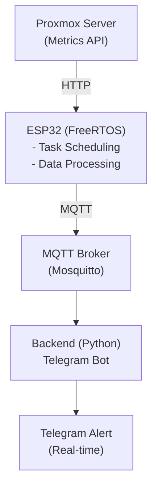

# ESP32 RTOS Server Telemetry System

## 🧠 Overview

A real-time server monitoring system built using ESP32 (FreeRTOS), MQTT messaging, and a Dockerized backend.

---

## 🏗️ Architecture


---

## ✨ Features

- ⚡ FreeRTOS-based multi-task embedded system  
- 📡 Real-time telemetry pipeline (HTTP → MQTT)  
- 🔔 Automated alerting via Telegram bot  
- 🐳 Dockerized backend (Mosquitto + Python service)  
- 🧠 Event-driven, distributed system design  
- 🔁 Fault-tolerant (reconnect + watchdog design)  

---

## ⚙️ Tech Stack

| Layer         | Technology              |
|--------------|------------------------|
| Embedded     | ESP32, FreeRTOS        |
| Networking   | HTTP, MQTT             |
| Backend      | Python                 |
| Infrastructure | Docker, Proxmox      |
| Messaging    | Telegram Bot           |

---

## 📸 Demo

### 🔔 Telegram Alert
(Input Documentation Here)


---

## 🚀 Getting Started

### 1. Clone repo
```bash
git clone https://github.com/YOUR_USERNAME/esp32-rtos-server-telemetry.git
cd esp32-rtos-server-telemetry
```
### 2. Start backend (Docker)
```bash
cd infra
docker-compose up -d
```
### 3. Run metrics API
```bash
python3 metrics.py
```
### 4. Flash ESP32
Open firmware/ using PlatformIO or Arduino IDE
Update config:
```bash
const char* mqtt_server = "YOUR_SERVER_IP";
const char* serverUrl = "http://YOUR_SERVER_IP:8000/metrics.json";
```
---
## MQTT Topics
- Topic	Description
- server/telemetry	Periodic metrics
- server/alert	Alert events
---
## Design Decisions
- FreeRTOS → real-time scheduling & concurrency
- MQTT → lightweight telemetry messaging
- ESP32 → edge node simulation
- Docker → reproducible backend deployment
---
## Security (Planned Improvements)
- MQTT authentication
- TLS encryption
- API authentication
- Network segmentation
---
## Future Work
- 📊 Grafana dashboard (visual monitoring)
- 🧠 Predictive alerting (AI/threshold learning)
- 🔄 OTA updates for ESP32
- 💾 Time-series database (InfluxDB)
---
